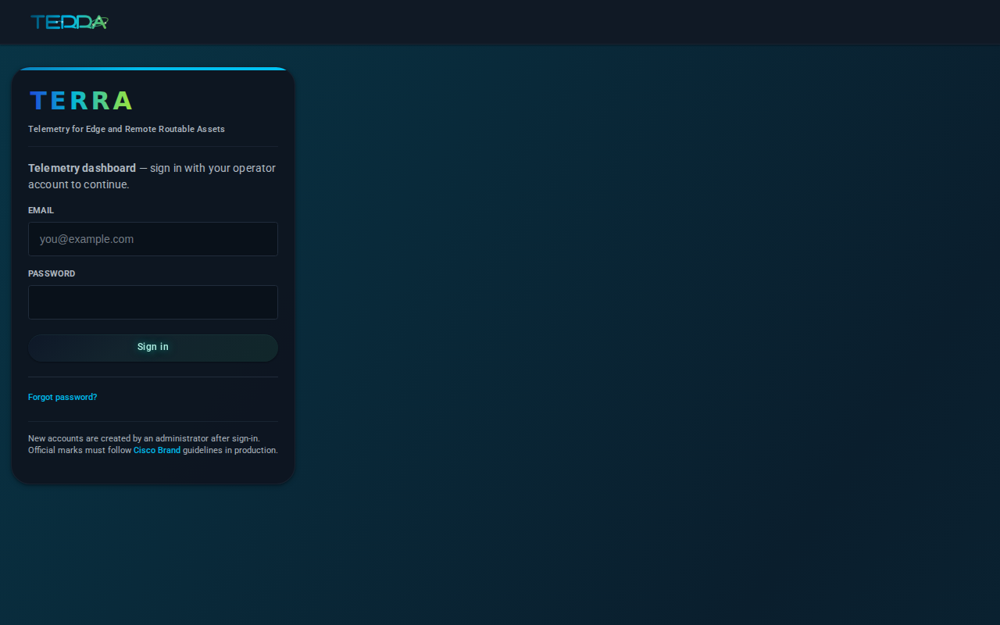
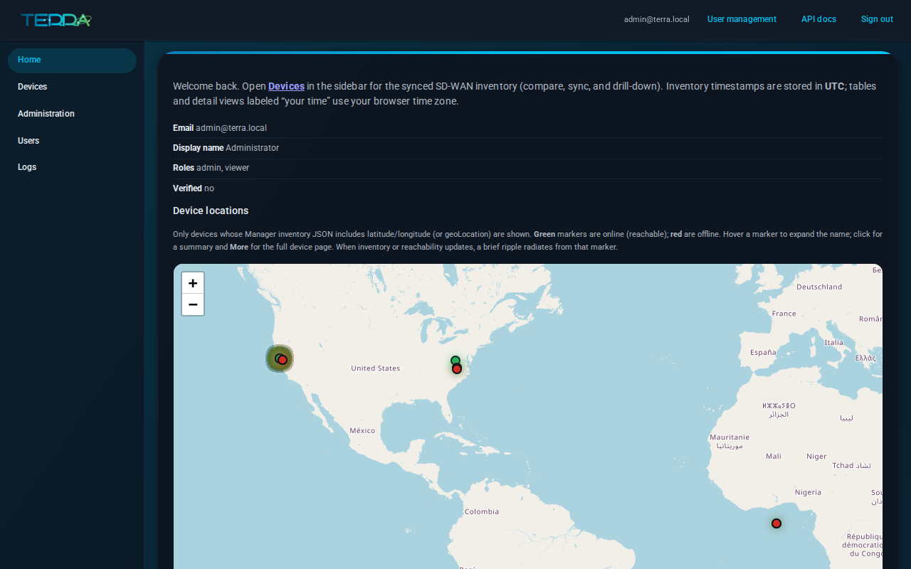
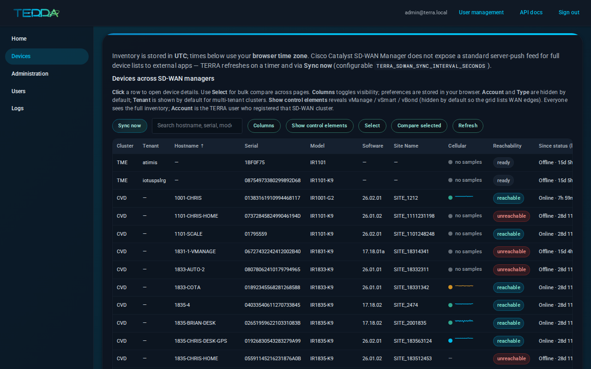
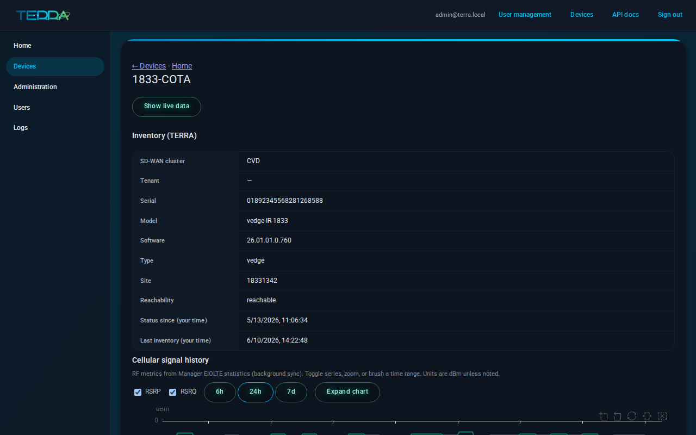
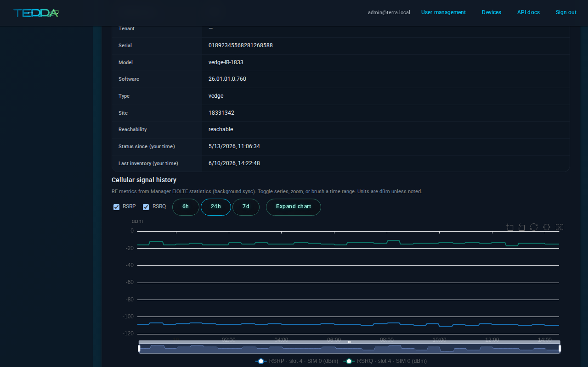
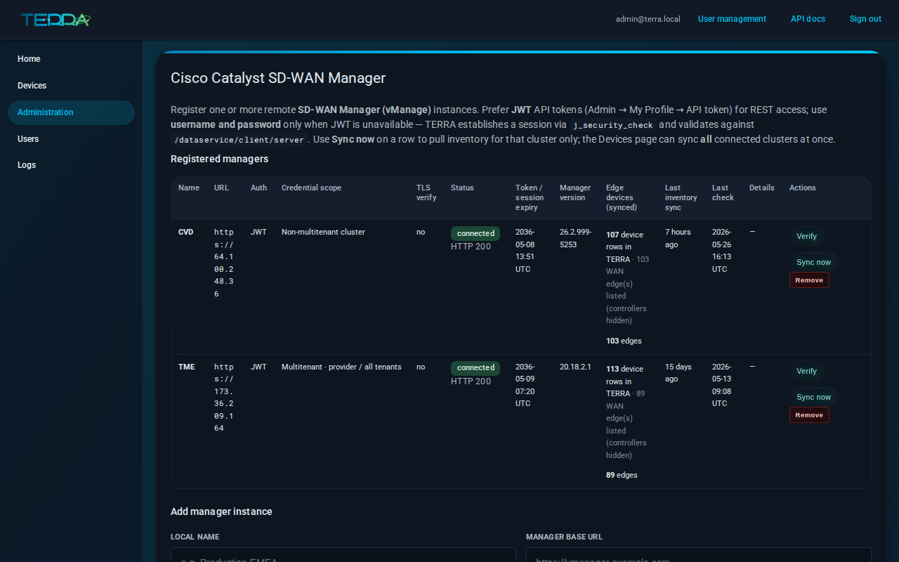

# TERRA

**T**elemetry for **E**dge and **R**emote **R**outable **A**ssets — a proof-of-concept operations dashboard built **on top of Cisco Catalyst SD-WAN Manager APIs**.

TERRA shows how partners and customers can assemble a **multi-cluster SD-WAN monitoring view** using Manager **dataservice** reads: inventory, live device telemetry, and cellular RF history. Configuration, policy, and templates stay in **Manager**; TERRA is for **monitor and report**, not for replacing the Manager WebUI or shipping as a production SaaS.

**Who it is for:** operators who want a compact fleet picture across one or more Managers, and integrators evaluating API patterns. The API map TERRA uses today is documented in [`specs/sdwan-manager-api.md`](specs/sdwan-manager-api.md).

---

## Features

### Sign-in and role-based access

Dashboard-local users, sessions, and admin roles — day-to-day monitoring does not depend on end-user Manager WebUI accounts. Admins manage users at **`/admin/users`**.



### Home map

When Manager inventory includes latitude/longitude (or `geoLocation`), signed-in users see a **fleet map** with reachability-colored markers and links into device detail.



### Devices across Managers

A paginated **devices grid** (React + TanStack Table) lists WAN edges from every registered Manager: search, sort, column toggles, multi-page **compare**, and **Sync now** for on-demand inventory refresh. Multitenant Managers show a **Tenant** column.



**API behind this:** inventory via `GET /dataservice/device` (and multitenant `tenant/switch` + `system/device/vedges`) — see [`specs/sdwan-manager-api.md`](specs/sdwan-manager-api.md).

### Cellular at a glance

Cellular-capable rows show a **Datatype sparkline** (last 24 hours of EIOLTE buckets, up to 20 points) and an **RSSI quality dot** (configurable dBm thresholds).

### Device drill-down and live data

Open a device for inventory fields, interface tables, and **Show live data** — on-demand polls of Manager **device realtime** APIs (`/dataservice/device/interface`, `/device/cellular/*`, etc.).



### Cellular RF history

Historical RSRP/RSRQ/RSSI comes from Manager **EIOLTE statistics** (`POST /dataservice/statistics/eiolte/uniqueAggregation`), ingested into **VictoriaMetrics**, and charted on the device page (24h default, zoom/brush, metric toggles).



Recipe reference: [cellular-signal-thresholds](https://github.com/etychon/Catalyst-SD-WAN-API-User-Receipe/blob/main/docs/recipes/cellular-signal-thresholds.md).

### Register SD-WAN Managers

Under **Administration → SD-WAN**, add each Manager base URL and credentials (session or JWT), **Verify** connectivity, and view **credential scope** (single-tenant vs multitenant provider/tenant token).



### Background sync and optional Grafana

- **`collector`** service — periodic inventory sync and cellular history ingest (VictoriaMetrics).
- **`core`** service — Web UI and JSON API.
- **Optional Grafana** — `docker compose --profile grafana up -d` (port **3000** by default) with a provisioned VictoriaMetrics datasource.

Stack layout: [`specs/architecture.md`](specs/architecture.md) and [`docker-compose.yml`](docker-compose.yml).

---

## Prerequisites

| Requirement | Notes |
|-------------|--------|
| **Linux host** (or AWS EC2) | Docker Engine + **Compose v2** (`docker compose`), Git |
| **Network** | Outbound HTTPS from the host to your Manager URL(s) |
| **SD-WAN Manager** | Base URL + API user (session or JWT) with inventory read access |
| **Local Python/Node** | **Not** required for operators — Compose builds the app and devices grid |

---

## Quick start — Linux

### 1. Clone the repository

```bash
git clone https://github.com/etychon/TERRA.git
cd TERRA
```

### 2. Configure environment

```bash
cp .env.example .env
```

Edit `.env` and set at minimum:

- `TERRA_SECRET_KEY` — at least 32 random characters
- `TERRA_ADMIN_EMAIL` / `TERRA_ADMIN_PASSWORD` — bootstrap admin (first boot only)

Optional: `TERRA_HTTPS_PORT` (default **4434**).

### 3. Start the stack

```bash
docker compose up --build -d
```

Services: **`web`** (HTTPS edge), **`core`** (UI/API), **`collector`** (sync), **`postgres`**, **`victoriametrics`**.

### 4. Verify health

```bash
curl -sk https://localhost:4434/health
```

### 5. Sign in

Open **`https://localhost:4434/auth/login`**. Accept the **self-signed** certificate warning on first visit (or install your own certs — see [`docker/certs/README.md`](docker/certs/README.md)).

Unless you changed `.env` before the first database seed, the bootstrap admin is:

| | Value |
|---|--------|
| **Email** | `admin@terra.local` |
| **Password** | `ChangeMe!Admin-1st-login` |

Change these for any shared or non-local deployment.

### 6. Connect your SD-WAN Manager

1. Go to **Administration → SD-WAN** (`/administration/sd-wan`).
2. Add **display name**, **Manager base URL**, and credentials.
3. Click **Verify** — fix auth or network issues until status is linked.
4. Open **Devices** and click **Sync now** (or wait for the background collector).

See [Connect your SD-WAN environment](#connect-your-sd-wan-environment) below for auth modes and multitenant notes.

### 7. Stop or reset

```bash
docker compose down          # stop containers, keep data volumes
docker compose down -v       # also remove Postgres + VictoriaMetrics volumes
```

**Follow logs:** `docker compose logs -f web core collector`

<details>
<summary>Lab diagnostics only (debug overlay)</summary>

For local inspection (`/debug/summary`, redacted DB/Manager samples), use [`scripts/launch-terra-debug.sh`](scripts/launch-terra-debug.sh) or `docker-compose.debug.yml`. **Do not** expose this overlay on production-facing hosts. See comments in [`.env.example`](.env.example).

</details>

---

## Deploy on AWS (EC2)

This PoC runs the same **Docker Compose** stack on a single EC2 instance. There is no Terraform/CloudFormation in the repo today.

### 1. Launch an instance

- **AMI:** Amazon Linux 2023 or Ubuntu 22.04 LTS
- **Size:** `t3.small` or larger (build + sync are CPU/network heavy)
- **Architecture:** **x86_64** or **arm64** (images are multi-arch)

### 2. Security group

Allow inbound only from trusted sources:

| Port | Purpose |
|------|---------|
| **4434/tcp** | TERRA HTTPS UI (`TERRA_HTTPS_PORT`) |
| **22/tcp** | SSH administration |

Avoid `0.0.0.0/0` on SSH; restrict **4434** to your office/VPN CIDR where possible.

### 3. Install Docker

On **Amazon Linux 2023** (example):

```bash
sudo dnf update -y
sudo dnf install -y docker git
sudo systemctl enable --now docker
sudo usermod -aG docker "$USER"
# log out and back in, then:
docker compose version
```

If the Compose plugin is missing, follow [Docker Engine install docs](https://docs.docker.com/engine/install/) for your distro.

### 4. Clone and configure

```bash
git clone https://github.com/etychon/TERRA.git
cd TERRA
cp .env.example .env
```

Set strong `TERRA_SECRET_KEY`, `TERRA_ADMIN_EMAIL`, and `TERRA_ADMIN_PASSWORD` in `.env`.

### 5. Start TERRA

```bash
docker compose up --build -d
curl -sk https://127.0.0.1:4434/health
```

### 6. Open the UI

Browse to **`https://<instance-public-ip>:4434`**, accept the self-signed cert (or place real PEMs in [`docker/certs/`](docker/certs/) before start).

### 7. Persistence

Compose volumes **`terra_pg`** (inventory, users) and **`terra_vm`** (metrics) live on the instance EBS root (or attached volume). Back up before `docker compose down -v`.

### 8. Production caveats

This repository is a **PoC sample**: replace self-signed TLS, rotate secrets, narrow security groups, use strong passwords, and **do not** enable the debug overlay on the public Internet. For TLS at scale, you can terminate HTTPS with **ACM + ALB** in front of the instance (high level only — not documented step-by-step here).

---

## Connect your SD-WAN environment

| Topic | Guidance |
|-------|----------|
| **API surface** | [`specs/sdwan-manager-api.md`](specs/sdwan-manager-api.md) — every Manager path TERRA calls |
| **Session auth** | Form login to `/j_security_check`; CSRF token from `/dataservice/client/token` |
| **JWT auth** | Bearer token; refresh `X-XSRF-TOKEN` from `/dataservice/client/server` before statistics POSTs |
| **Multitenant** | Tenant list + `POST /dataservice/tenant/{id}/switch`; credential scope badge on admin table — [`specs/integrations.md`](specs/integrations.md) |
| **Cellular history** | Requires successful sync, `TERRA_CELLULAR_HISTORY_ENABLED`, and VictoriaMetrics; see [`.env.example`](.env.example) |

Integrator cookbook (external): [Catalyst SD-WAN API User Recipe](https://github.com/etychon/Catalyst-SD-WAN-API-User-Receipe).

---

## Configuration reference

Full list: [`.env.example`](.env.example). Common operator variables:

| Variable | Default (Compose) | Purpose |
|----------|-------------------|---------|
| `TERRA_HTTPS_PORT` | `4434` | Host port for HTTPS UI |
| `TERRA_ADMIN_EMAIL` / `TERRA_ADMIN_PASSWORD` | see compose | Bootstrap admin (first seed) |
| `TERRA_SECRET_KEY` | dev placeholder | Session/crypto secret — **change in production** |
| `TERRA_POSTGRES_PASSWORD` | dev placeholder | Postgres password |
| `TERRA_SDWAN_BACKGROUND_SYNC` | `false` on core, `true` on collector | Periodic inventory sync |
| `TERRA_CELLULAR_HISTORY_ENABLED` | `true` | EIOLTE → VictoriaMetrics ingest |
| `TERRA_GRAFANA_PORT` | `3000` | Optional Grafana profile |

---

## For contributors

| Resource | Purpose |
|----------|---------|
| [`AGENTS.md`](AGENTS.md) | Agent/PR conventions, CI, spec discipline |
| [`LLM_CONTEXT.md`](LLM_CONTEXT.md) | Dense product + integration context |
| [`specs/`](specs/) | Canonical product and architecture decisions |
| [`docs/`](docs/) | Extra human docs and README screenshots |

**Local tooling** (optional — Compose remains the default run path):

```bash
python -m venv .venv && source .venv/bin/activate
pip install -e ".[dev]"
pytest
npm install && npm run lint && npm run build:devices-grid
```

**Re-capture README screenshots:** `TERRA_SCREENSHOT_BASE_URL=https://localhost:4434 node scripts/capture-readme-screenshots.mjs` — see [`docs/images/README.md`](docs/images/README.md).

| Path | Purpose |
|------|---------|
| `src/terra/` | FastAPI **core** — auth, UI, APIs |
| `src/terra_sdwan/` | SD-WAN Manager connector (sync, live, cellular history) |
| `frontend/src/devices/` | Devices grid React island → `static/dist/devices-grid.js` |
| `tests/` | pytest suite |
| `e2e/` | Playwright smoke tests |

---

## License

This sample is distributed under the **Cisco Sample Code License, Version 1.1**; see [`LICENSE`](LICENSE).
