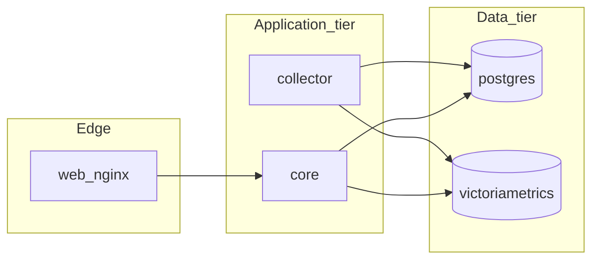

# Architecture decisions (TERRA)

## Intent

Build a **multi-cluster monitoring dashboard** with **dashboard-owned authentication**, consuming **Cisco Catalyst SD-WAN Manager APIs** first. **Configuration** remains primarily in Manager.

## High-level shape (target)

- **Connectors** abstract upstream systems:
  - `sdwan-manager` (initial)
  - `catalyst-center` (future; may share device identity concepts but different APIs and scope)
- **Ingestion / sync** jobs pull device and telemetry primitives on sane intervals; respect API rate limits and pagination.
- **Projection layer** (read models) powers UI lists, maps, and history charts without hammering upstream on every page load.
- **Alerting** combines upstream events with dashboard-defined thresholds (details TBD).

## Microservices (Compose default)

The runnable stack is still **one repository** and **one operator command** (`docker compose up --build -d`). Services are split for **scale** and **blast radius**: HTTP/UI work stays in **`core`**; upstream polling and metric emission stay in **`collector`**.

### Service responsibilities

1. **`web`:** TLS termination only; proxies to **`core:8000`** on the internal network.
2. **`core`:** FastAPI app — sessions, RBAC, Jinja/API routes, on-demand SD-WAN sync jobs triggered by users. **Does not** start the periodic Manager inventory loop (`TERRA_SDWAN_BACKGROUND_SYNC=false` in default Compose for this service).
3. **`collector`:** Long-running worker — same Python install, **`TERRA_SDWAN_BACKGROUND_SYNC=true`**, periodic `sync_all_connected_managers`, **VictoriaMetrics** push for sparse operational gauges (inventory counts, sync success timestamps). Writes **`collector_status`** heartbeat and persists periodic **`sdwan_sync_batch`** log lines to Postgres for the admin Logs UI on **`core`**. Docker healthcheck uses heartbeat freshness (`scripts/collector_healthcheck.py`). Horizontally scalable later via sharded managers + a queue (not required in v1).
4. **`postgres`:** Default **relational** store in Compose for `core` and `collector` (replaces SQLite for multi-writer and larger fleets). Local dev may still use SQLite when not using full Compose data tier.
5. **`victoriametrics`:** Long-retention **metrics** store; PromQL-compatible API. Details: [`specs/telemetry-storage.md`](telemetry-storage.md).
6. **`grafana` (optional profile `grafana`):** Pre-wired datasource to VictoriaMetrics for partner/power-user dashboards.

### Python layout

- **`terra_sdwan`:** importable package for SD-WAN HTTP client, inventory sync, device live/enrichment, operator HTTP logging context — shared by **`core`** and **`collector`** without duplicating code.
- **`terra`:** application shell (FastAPI `main`, routers, models, CRUD, auth).

### Phased migration (implemented direction)

- **Phase A:** Postgres + VictoriaMetrics in Compose; metrics writer module; **`core`** may still run background sync in non-Compose installs — Compose defaults disable it on **`core`** only.
- **Phase B:** Background sync **only** on **`collector`**; **`core`** relies on collector for freshness between user-triggered syncs.
- **Phase C (future):** Redis/NATS job queue for multiple collector replicas; Grafana as default-on only if product requires it.

## Runtime and packaging

- **Operator UI** follows `specs/design-system.md` (Tailwind + shadcn-style CSS variables, token layers, automated guardrails) and ships with the same **Compose**-first story as the API services.
- **Docker Compose** is the **mandatory** default way to run the delivered application stack (services, dependencies, documented `up` / `down` workflow).
- **Canonical command (repo root):** `docker compose up --build -d` — brings up all defined services; default **user-facing WebUI** is **`https://localhost:4434`** (nginx TLS edge → **`core`**). Override host port via `TERRA_HTTPS_PORT` in `.env`. Default certificate is **self-signed**; operators may drop **`server.crt` / `server.key`** PEMs into `docker/certs/` before start. Liveness: **`GET /health`** through the HTTPS edge.
- **Admin operator logs:** merged in-memory ring buffer (core) + persisted collector batch lines (Postgres); `/admin/logs`, `GET /api/v1/admin/logs`, `GET /api/v1/admin/collector-status` (see `specs/logging-ui.md`); not a full SIEM audit trail.
- **Platforms:** **macOS**, **Linux**, and **Windows** (support **Docker Desktop** with the WSL2-backed engine as the documented Windows model).
- **CPU:** images and Compose must support **amd64** and **arm64** (including **Apple Silicon** Macs).

### SD-WAN multi-manager inventory sync

- **SQLite** (default when `TERRA_DATABASE_URL` is SQLite): raising **`TERRA_SDWAN_BATCH_MAX_CONCURRENT_MANAGERS`** increases parallel inventory writers and may cause `database is locked`; keep the default low or use **PostgreSQL** (Compose default) for heavy multi-Manager parallel sync.

## Secrets and credentials (checklist)

- Manager credentials remain **encrypted at rest** (`secret_store`); **never** log `j_password`, decrypted JSON, or `Authorization` headers.
- **`TERRA_SECRET_KEY`** rotation requires re-encrypting stored Manager blobs (document in runbooks); use a secrets manager in production.
- Query strings must not carry passwords; HTTPS only for browser traffic.

## Considered / discarded

- **“Screen scrape the Manager WebUI”** — rejected: brittle, auth-coupled, and hostile to multi-cluster scale.
- **“Embed Manager UI in an iframe”** — rejected: does not meet the “simple, intern-friendly” bar and blurs security boundaries.
- **“Bare-metal / native install as the only supported path”** — rejected as the **primary** story: operators and agents need a single, repeatable Compose-based entrypoint; native installs may exist later as optional extras if justified.
- **“Store high-cardinality time series in Postgres JSON”** — rejected as the primary path: use VictoriaMetrics per [`specs/telemetry-storage.md`](telemetry-storage.md).

## Open points

- Deployment topology (single-tenant SaaS vs customer-hosted vs hybrid).
- **Clustered** VictoriaMetrics / HA Postgres for very large on-prem footprints.
- **Push** vs **pull** for syslog/alarm streams once Manager endpoints are productized in this repo.

When implementation choices land, update this file in the same PR.
